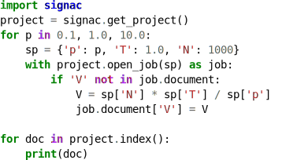

.. signac documentation master file, created by
   sphinx-quickstart on Fri Oct 23 17:41:32 2015.
   You can adapt this file completely to your liking, but it should at least
   contain the root `toctree` directive.

Welcome to signac's documentation!
==================================

.. image:: https://zenodo.org/badge/72946496.svg
   :target: https://zenodo.org/badge/latestdoi/72946496

.. image:: https://anaconda.org/conda-forge/signac/badges/version.svg
   :target: https://anaconda.org/conda-forge/signac

.. image:: https://img.shields.io/pypi/v/signac.svg
   :target: https://img.shields.io/pypi/v/signac.svg

.. image:: https://readthedocs.org/projects/signac/badge/?version=latest
   :target: https://signac.readthedocs.io

.. image:: https://img.shields.io/github/license/csadorf/signac.svg
   :target: https://bitbucket.org/glotzer/signac/src/master/LICENSE.txt

.. automodule:: signac

.. important::

    This is documentation for the **signac** *package*, which is part of the signac_ framework.
    See the signac-docs_ for a comprehensive introduction to the **signac** *framework*.

.. _signac: https://glotzerlab.engin.umich.edu/signac/
.. _signac-docs: https://signac-docs.readthedocs.io/en/latest

Contents
--------

.. toctree::
   :hidden:
   :maxdepth: 2

   overview
   installation
   tutorial
   reference
   quick_reference
   changes
   acknowledge
   signac

.. glossary::

    :ref:`overview`
      An illustration of **signac**'s data model.

    :ref:`installation`
      Instructions on how to install the **signac** package.

    :ref:`tutorial`
      Compact demonstration of the implementation of a computational workflow.

    :ref:`reference`
      A complete reference to the framework's major components.

    :ref:`quickreference`
      Brief overview of the core functions, to serve as reference.

    :ref:`acknowledge`
      Instructions on how to acknowledge this software in publications.

    :ref:`api`
      The complete API reference.

Support and Contribution
------------------------

To get help using the signac package, either send an email to `signac-support@umich.edu <mailto:signac-support@umich.edu>`_ or join the `signac gitter chatroom <https://gitter.im/signac/Lobby>`_.

The **signac** package is hosted on `bitbucket <https://bitbucket.org/glotzer/signac>`_ and licensed under the open-source BSD 3-Clause license.
Please use the `repository's issue tracker <https://bitbucket.org/glotzer/signac/issues?status=new&status=open>`_ to report bugs or request new features.

Indices and tables
==================

* :ref:`genindex`
* :ref:`modindex`
* :ref:`search`
