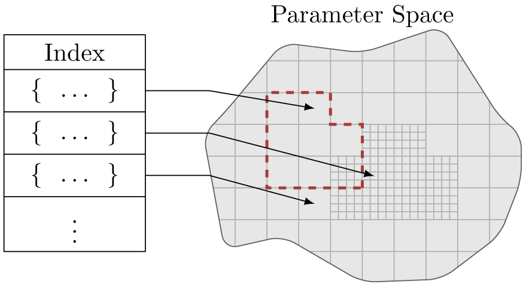

.. _overview:

Overview
========

**signac**'s workflow is designed to assist large-scale multidimensional computational data generation and analysis.
We assume that we can divide our work into so called *projects*, where each project is vaguely confined by roughly similar structured data, e.g. a parameter study.

We define the process of generating or manipulating data a *job*.
Every job operates on a set of well-defined unique parameters, which define the job's context.
This means that all data is uniquely addressable from the associated parameters.

You can use signac to manage a project based on this data model and index data for export into a database.
